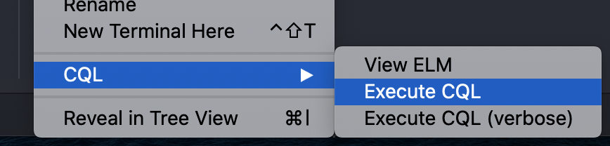

# RIP_Oct2020

## Atom _language-cql package_ tips

### File Structure
__/cql__ - use this folder to hold your .cql files.
* _ex: /cql/MyFirstCQL.cql_

__/input/tests__ - this folder will hold your test folders, one for each .cql file.
* _ex: /input/tests/MyFirstCQL_

__/input/tests/_testName___ - each test folder will hold the resources needed for your CQL retrieves, they are stored within another folder whose name should be the ID of your Patient resource.
* _ex: /input/tests/MyFirstCQL/123456_

__/input/tests/_testName_/_patientID___ - within this folder will be additional folders which should be named according to the type of FHIR resource they hold.
* _ex: /input/tests/MyFirstCQL/123456/Patient/_
* _ex: /input/tests/MyFirstCQL/123456/Observation/_
* _ex: /input/tests/MyFirstCQL/123456/Condition/_
* _ex: /input/tests/MyFirstCQL/123456/Encounter/_

There is no required naming convention for the FHIR resource .json files within these folders.
* _ex: /input/tests/MyFirstCQL/123456/Patient/patient.json_
* _ex: /input/tests/MyFirstCQL/123456/Observation/observation-123.json_
* _ex: /input/tests/MyFirstCQL/123456/Observation/observation-456.json_

__/input/vocabulary/valueset__ - valuesets referenced by your .cql files should be stored here as FHIR ValueSet resource .json files. The "url" field should match the URL declared in your .cql file.
* _ex: (in CQL file) valueset_:
    * "Test valueset": 'http://fake-url.org/fhir/ValueSet/TestSet'
* _ex: (in /input/vocabulary/valueset/valueset-789.json)_:
    * {
           "resourceType":"ValueSet",
           "id":"789",
           "url":"http://fake-url.org/fhir/ValueSet/TestSet",
           "version":"1.0.0",
           "name":"TestSet",
           ...
        }

To execute a .cql file: right-click, scroll down to the CQL option, and click execute.

